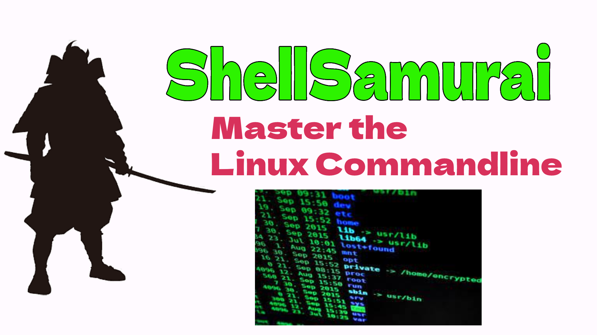

# my_first_repo

This is some text in markdown I made! 

Markdown is cool cause you can add [links](https://shellsamurai.com)

and images!

We can make text **bold** or *italic*

You can make bulleted lists:

- item 1 
- item 2 
- item 3

or quotes:

> This is my shell 
> There are many like it
> But this one is mine

Fancy horizontal lines:

---

and headings galore!

# big heading, H1 size
## smaller heading, H2 size
### smallest heading, H3 size

We made a change here!
